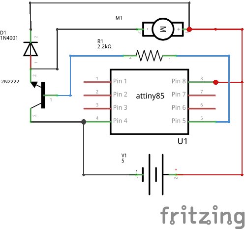
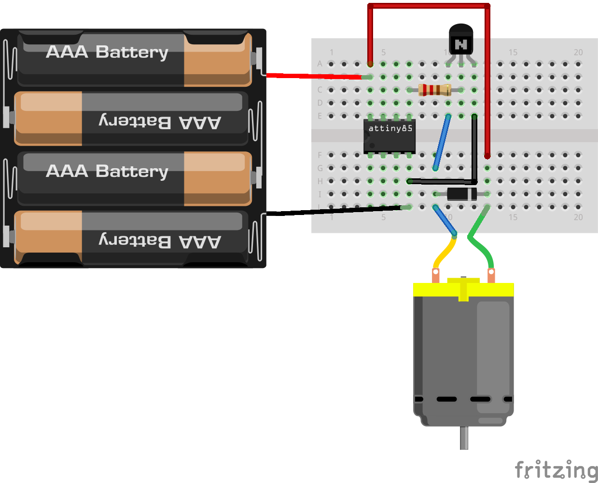

DCmotor and Transistor
======================

Overview of the experiment
--------------------------

The Anuduino pins are great for driving LEDs however if we hook 
up something that requires more power, We need an external transistor.
Here we will use a transistor to control a small DCmotor. A transistor
is incredibly useful. It switches a lot of current using a much smaller
current. A transistor has 3 pins. For a negative type(NPN) transistor,
We connect our load to collector and the emitter to ground. Then when 
a small current flows from base to the emitter, a current will flow 
through the transistor and our motor will spin. Here we are using a 
P2N2222AG transistor.

Components required
-------------------

- Breadboard     x1
- Attiny85       x1
- DCmotor        x1
- Tranistor(P2N2222) x1
- Diode(1N4007)      x1
- Resistor(2.2k)     x1
- powersupply(5v)

Schematic
---------

Circuit Diagram
---------------

Code
----

.. code-block::  c

  
    
	int motorPin = 0;  // define the pin the motor is connected to
                  

	/*
	 * setup() - this function runs once when you turn your Anuduino on
	 * We set the motors pin to be an output (turning the pin high (+5v) or low    (ground) (-))
	 * rather than an input (checking whether a pin is high or low)
	 */
	void setup()
	{
	 pinMode(motorPin, OUTPUT); 
	}

	/*
	 * loop() - this function will start after setup finishes and then repeat
	 * we call a function called motorOnThenOff()
	 */

	void loop()                     // run over and over again
	{
	 motorOnThenOff();
	 //motorOnThenOffWithSpeed();
	 //motorAcceleration();
	}

	/*
	 * motorOnThenOff() - turns motor on then off 
	 * (notice this code is identical to the code we used for
	 * the blinking LED)
	 */
	void motorOnThenOff(){
	  int onTime = 2500;  //the number of milliseconds for the motor to turn on for
	  int offTime = 1000; //the number of milliseconds for the motor to turn off for
  
	  digitalWrite(motorPin, HIGH); // turns the motor On
	  delay(onTime);                // waits for onTime milliseconds
	  digitalWrite(motorPin, LOW);  // turns the motor Off
	  delay(offTime);               // waits for offTime milliseconds
	}

	/*
	 * motorOnThenOffWithSpeed() - turns motor on then off but uses speed values as    well 
	 * (notice this code is identical to the code we used for
	 * the blinking LED)
	 */
	void motorOnThenOffWithSpeed(){
  
	  int onSpeed = 200;  // a number between 0 (stopped) and 255 (full speed) 
	  int onTime = 2500;  //the number of milliseconds for the motor to turn on for
  
	  int offSpeed = 50;  // a number between 0 (stopped) and 255 (full speed) 
	  int offTime = 1000; //the number of milliseconds for the motor to turn off for
  
	  analogWrite(motorPin, onSpeed);   // turns the motor On
	  delay(onTime);                    // waits for onTime milliseconds
	  analogWrite(motorPin, offSpeed);  // turns the motor Off
	  delay(offTime);                   // waits for offTime milliseconds
	}

	/*
	 * motorAcceleration() - accelerates the motor to full speed then
	 * back down to zero
	*/
	void motorAcceleration(){
	  int delayTime = 50; //milliseconds between each speed step
  
	  //Accelerates the motor
	  for(int i = 0; i < 256; i++){ //goes through each speed from 0 to 255
	    analogWrite(motorPin, i);   //sets the new speed
 	   delay(delayTime);           // waits for delayTime milliseconds
	  }
  
	  //Decelerates the motor
	  for(int i = 255; i >= 0; i--){ //goes through each speed from 255 to 0
	    analogWrite(motorPin, i);   //sets the new speed
	    delay(delayTime);           // waits for delayTime milliseconds
	  }
	}

