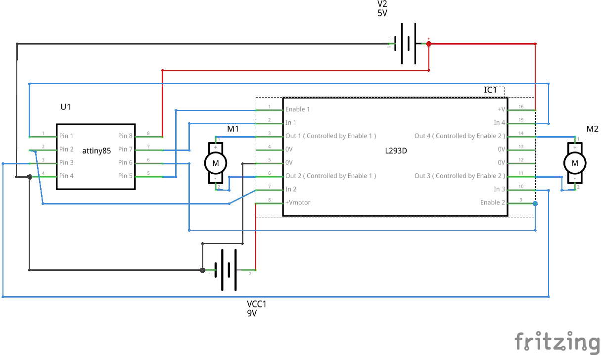
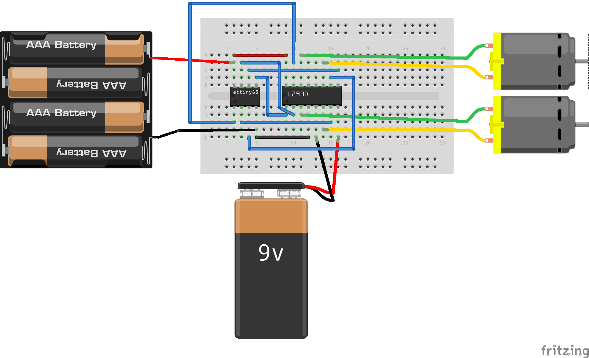

Two DCmotors spinning
=====================

Overview of the experiment
--------------------------

The spinning of the motors in forward as well as backward direction can also be achieved using the L293d motor driver. The L293d is a dual H-bridge motor driver integrated circuit which can control a set of two DC motors simultaneously in any direction. In this experiment, we are rotating the motors both in forward, both in backward and one forward-one backward directions. If these two motors are used on a robot, one can achieve forward, backward as well as circular motion of the robot. The code here achieves each type of motion for 8 seconds with 2 second breaks between each. The time periods are obtained by using the delay function.

Components required
-------------------

- Breadboard             x1
- Attiny85               x1 
- L293d-motor-driver IC  x1 
- Dcmotor                x2
- powersupply(5v)        x1
- powersupply(12v)       x1

Schematic
---------

Circuit Diagram
---------------

Code
----

.. code-block:: c

    // @Author_Nivedita Tigadi, Piyush Mahajan, Samridha Kumar
    //2014_Internship IIT-Bombay.
    
    
    void setup()
    {
  pinMode(0,OUTPUT);
  pinMode(1,OUTPUT);
  pinMode(2,OUTPUT);
  pinMode(3,OUTPUT);
  pinMode(4,OUTPUT);
  pinMode(5,OUTPUT);  
    }

    void loop()
    {
  movefront();
  delay(2000);
  circular();
  delay(2000);
  moveback();
  delay(2000);
    }

    void movefront()
    {
  digitalWrite(0,LOW);
  digitalWrite(1,LOW);
  digitalWrite(2,HIGH);
  digitalWrite(3,LOW);
  digitalWrite(5,HIGH);
  digitalWrite(4,LOW);
  digitalWrite(0,HIGH);
  digitalWrite(1,HIGH);
  delay(8000);
  digitalWrite(0,LOW);
  digitalWrite(1,LOW);
    }

    void moveback()
    {
  digitalWrite(0,LOW);
  digitalWrite(1,LOW);
  digitalWrite(2,HIGH);
  digitalWrite(3,LOW);
  digitalWrite(4,HIGH);
  digitalWrite(5,LOW);
  digitalWrite(0,HIGH);
  digitalWrite(1,HIGH);
  delay(8000);
  digitalWrite(0,LOW);
  digitalWrite(1,LOW);
    }

    void circular()
    {
  digitalWrite(0,LOW);
  digitalWrite(1,LOW);
  digitalWrite(3,HIGH);
  digitalWrite(2,LOW);
  digitalWrite(4,HIGH);
  digitalWrite(5,LOW);
  digitalWrite(0,HIGH);
  digitalWrite(1,HIGH);
  delay(8000);
  digitalWrite(0,LOW);
  digitalWrite(1,LOW);
    }

	
	

