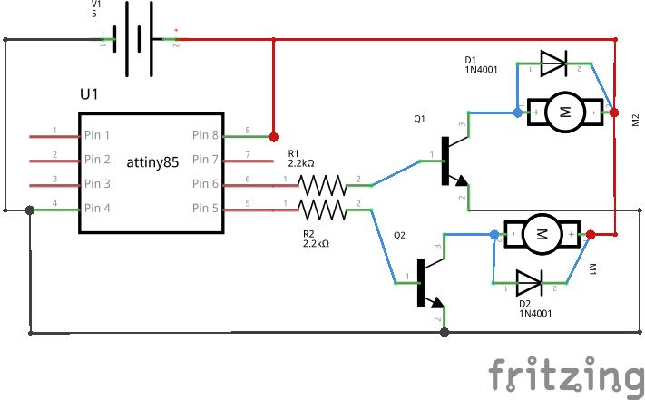
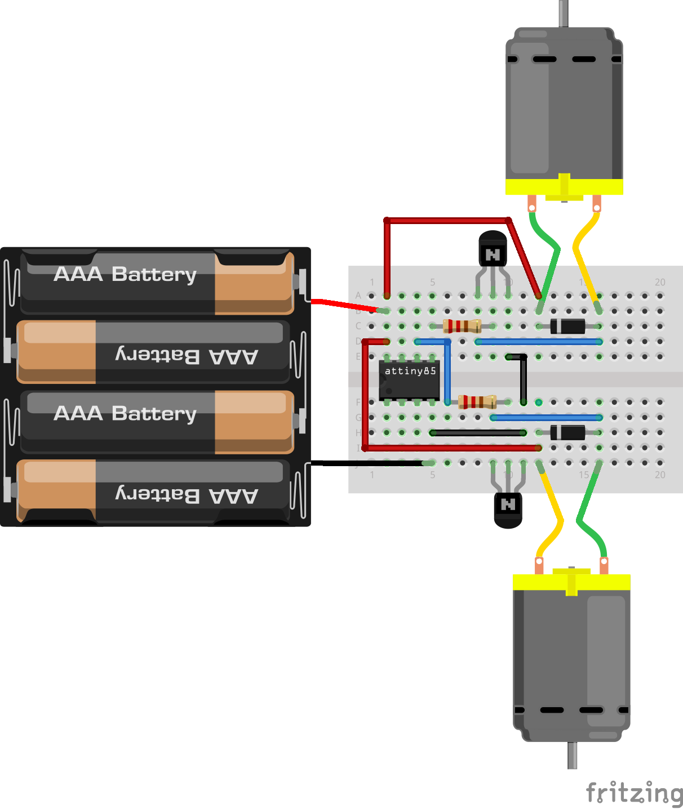

Two DCmotors spinning
=====================

Overview of the experiment
--------------------------

We are done with the single DCmotor. Now we are going to take two DCmotors.
In this experiment we are spinning two DCmotors,One in forward direction
and other in reverse direction. Similar circuit we are going to bulid here 
as we did for single DCmotor, and here we are using two transistors,two diodes
and two resistors.

Components required
-------------------

- Breadboard         x1
- Attiny85           x1
- Diode(1N4001)      x2
- Resistor(2.2k)     x1
- Transistor(2N2222) x2
- Dcmotor            x2
- powesupply(5v)

Schematic
--------

Circuit Diagram
---------------

Code
----

.. code-block:: c

    // @Author_Nivedita Tigadi.//
	const int motorForward = 0;
	const int motorReverse = 1;

	void setup()
	{
	  pinMode(motorForward, OUTPUT);
	  pinMode(motorReverse, OUTPUT);  
	}

	void loop() {
	    digitalWrite(motorForward, HIGH);
	    delay(1000);
	    digitalWrite(motorForward, LOW);
	    delay(1000);
 
	    digitalWrite(motorReverse, HIGH);
	    delay(1000);
	    digitalWrite(motorReverse, LOW);
	    delay(1000);
 
	}

