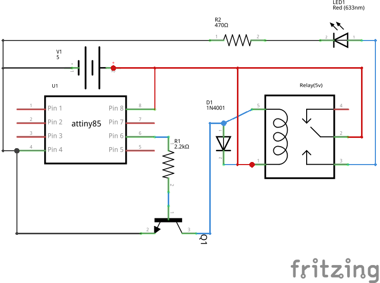
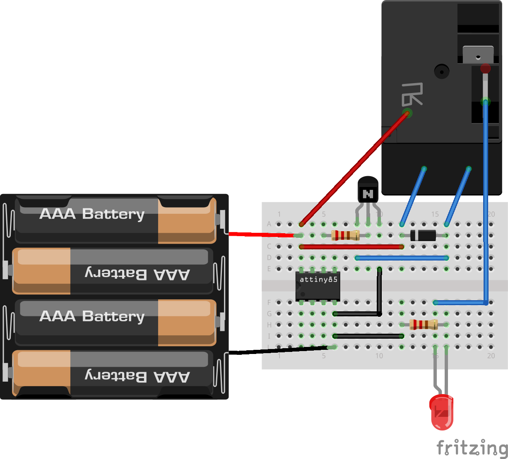

Relay-Anuduino
==============

Overview of the experiment
--------------------------

In this experiment we are interfacing relay with anuduino. we are
using a transistor to drive current for relay. Whenever relay gets
energized it will ON LED connected to it at the NO pin and when it 
gets de-energized it will turn OFF LED. we can use it for larger loads
also. we have to choose a proper relay.

Components required
-------------------

- Breadboard         x1
- attiny85           x1
- Relay(5V)          x1
- Diode(1N4001)      x1
- Transistor(2N2222) x1
- LED                x1
- Resistors(470 & 2.2k) x1
- Powersupply(5V)

Schematic
---------

Circuit Diagram
---------------

Code
----

.. code-block::  c

     // @Author_Nivedita Tigadi.
     //the setup routine runs once when you press reset:
     
    void setup()
     {   
      pinMode(1, OUTPUT); // initialize the digital pin as an output.
     }

       // the loop routine runs over and over again forever:
    void loop()
    
    {
    
    digitalWrite(1, HIGH);   // turn the LED on (HIGH is the voltage level)
    delay(1000);               // wait for a second
    digitalWrite(1, LOW);    // turn the LED off by making the voltage LOW
    delay(1000);               // wait for a second
    
    }

