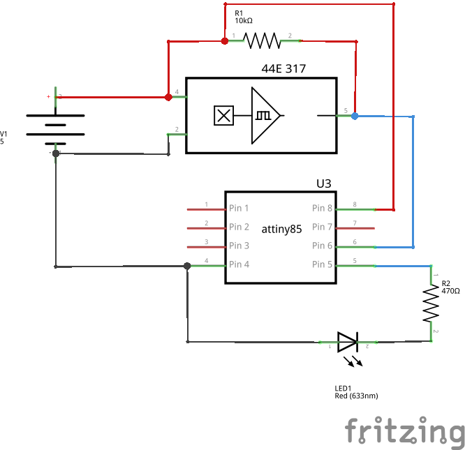
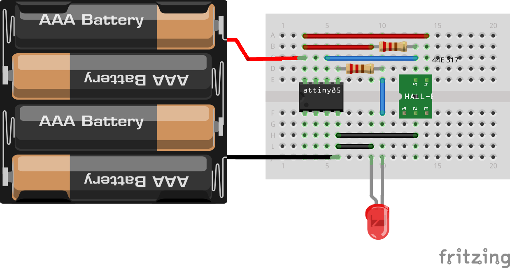

Hall effect Sensor
==================

Overview of the experiment
--------------------------

In this experiment we are going to interface our anuduino with
Halleffect sensor(44E 317).Holding a magnet near the sensor will 
cause the output pin to toggle.The LED connected to the pin 0 
will turn ON and OFF when the Halleffect sensor is triggered by magnet.

Components Required
-------------------

- Breadboard    x1
- Attiny85      x1
- Halleffect sensor(44E 317)  x1
- Resistors(470&10k ohm)       x1
- LED          x1
- Powersupply(5v)

Schematic
---------

Circuit Diagram
---------------

Code
----

.. code-block::  c

	/*
	@Author_Nivedita Tigadi.
 	Hall Effect Switch
 
	Turns on and off a light emitting diode(LED) connected to digital  
 	pin 0, when Hall Effect Sensor attached to pin 1 is triggered by a magnet
 
	 Hall effect sensor used is the 44E317
 

 
	*/

	// constants won't change. They're used here to set pin numbers:
	const int hallPin = 1;     // the number of the hall effect sensor pin
	const int ledPin =  0;     // the number of the LED pin
	// variables will change:
	int hallState = 0;          // variable for reading the hall sensor status

	void setup() {
	  // initialize the LED pin as an output:
	  pinMode(ledPin, OUTPUT);      
	  // initialize the hall effect sensor pin as an input:
	  pinMode(hallPin, INPUT);     
	}

	void loop(){
	  // read the state of the hall effect sensor:
	  hallState = digitalRead(hallPin);

	  if (hallState == LOW) {     
	    // turn LED on:    
	    digitalWrite(ledPin, HIGH);  
	  } 
	  else {
	    // turn LED off:
	    digitalWrite(ledPin, LOW); 
	  }
	}

