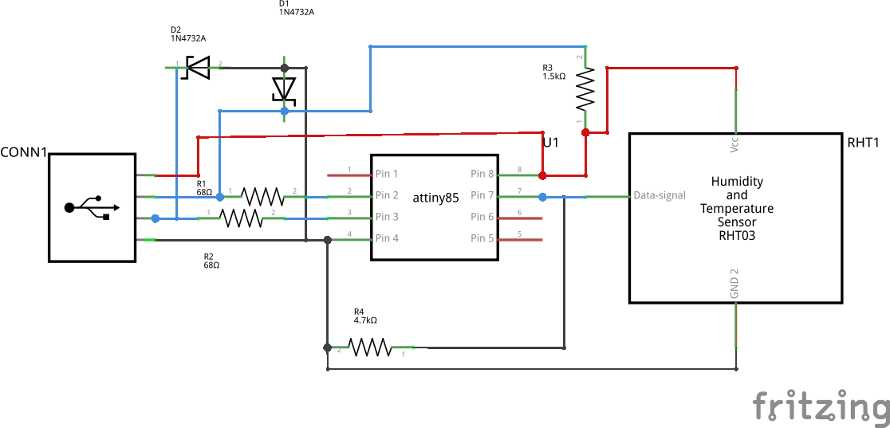

Humidity_Sensor-Anuduino
========================

Overview of the experiment
--------------------------

The DHT11 is interfaced with Anuduino in this experiment. 
Here the humidity sensor is conncted to analog pin 2 of Attin85. The 
circuit is connected on breadboard as shown in the below figures.
and The circuit is connected to the computer through USB. The values 
are observed on monitor by using DigiUSB. The DHT11 
reads humidity values from pin 2 and displays on the monitor of computer. 

Components required
-------------------

- Breadboard    x1
- Attiny85      x1
- Resistors(68 x2, 1.5k x1, 10k x1)
- ZenerDiode(3.6v)  x2
- USB        x1
- Humidity-sensor(dht-11)  x1

Schematic
---------

Circuit diagram
---------------

.. image:: ../images/15_humidity_sensor_bb.png

Code
----

.. code-block::  c

	*// this sketch reads data from humidity sensor and takes average of 30 samples in 4 seconds
	////@Author_Nivedita Tigadi
	#include <DigiUSB.h>
	#define TEMP 1 //using PB2 as analog INPUT

	void setup() {
	  DigiUSB.begin();
	  pinMode(2, INPUT); //defining PB2 as INPUT
  
	}

	void returnTemp( int degree ){
  
	 float celsius;
	 int sample;
	 int thirty_samples;
 
	   for (sample = 0; sample < 29; sample++) {
        // convert PB2 value to temperature
        celsius = ((float)analogRead(TEMP) * 5.0 / 1024.0);
        celsius = celsius / 0.01;
        // sample every 100 milliseconds
        delay(100);
        // sum of all samples
        thirty_samples = thirty_samples + celsius;
        DigiUSB.refresh();
       
	    }

    celsius = thirty_samples / 30.0; //taking average
 
	  if ( degree == 1 ){
    DigiUSB.print(celsius);
    DigiUSB.println("C");
    DigiUSB.delay(10);
  
	}
	  }
  

	void loop() {
  
	returnTemp(1); //calling function to output temp
	DigiUSB.delay(990);

	}

