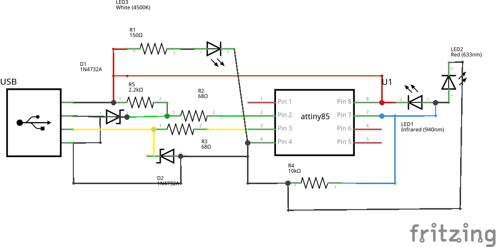
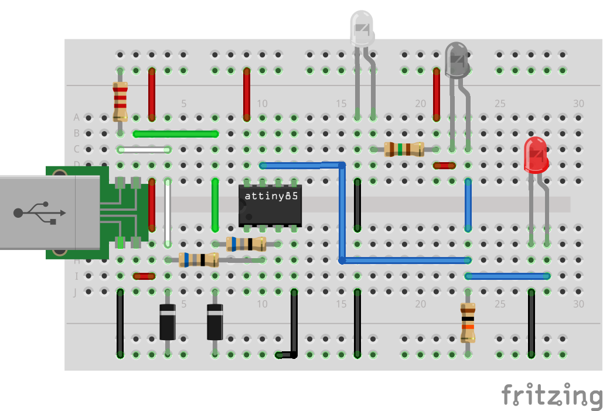

IR-Anuduino
===========

Overview of the experiment
--------------------------

In this experiment the IR sensor module is interfaced with
anuduino.We use 3 LEDs One as transmitter, One as receiver
and other LED as indicator.Whenevr IR receiver gets signal
the third LED glows. The IR is connected to analog pin 2 (ADC1).

Components required
-------------------

- Breadboard    x1
- Attiny85      x1
- Resistors(68 x2, 1.5k x1, 10k x1)
- ZenerDiode(3.6v)  x2
- USB               x1
- IR-sensor module  x1
- LED               x2

Schematic
---------

Circuit diagram
---------------

Code
----

.. code-block::  c

	#include <DigiUSB.h>

	void setup() {
	  DigiUSB.begin();
	  pinMode(2,INPUT);
	}

	void loop() {
	  // print output
	  DigiUSB.println("Waiting for input...");
	  // get input
	  int val=analogRead(1);
	  DigiUSB.println(val);
	  DigiUSB.refresh();
	  DigiUSB.delay(500);
	}

