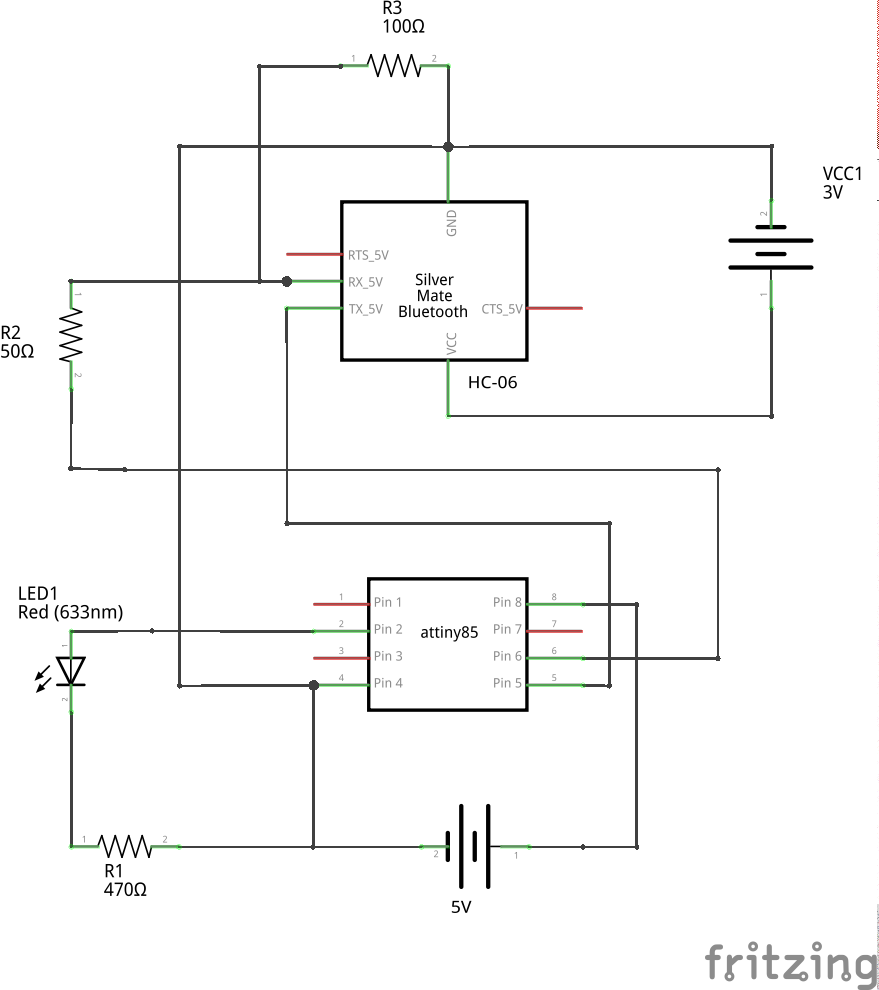
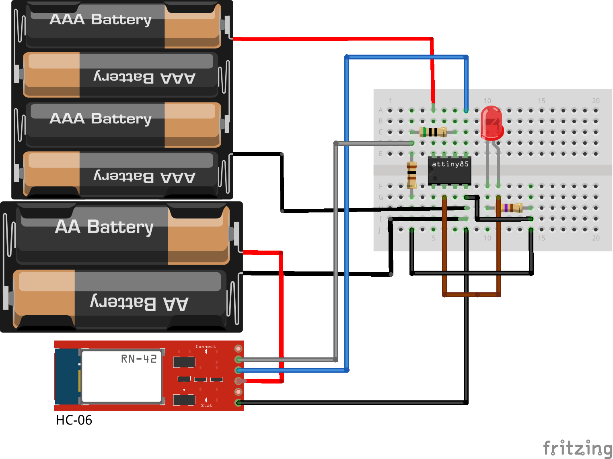

Bluetooth Anuduino Interfacing
==============================

Overview of the Experiment
--------------------------

Bluetooth communication has become one of the most widely used methods when it comes to data transfer.In this experiment we have interfaced a bluetooth module with an anuduino board to control the led.

We have used HC06 bluetooth module.This module works on 3.3 V supply.The TX pin on the bluetooth module is directly connected to RX on ATtiny85 and the TX on ATtiny85 is connected to 50 ohm which is connected to 100 ohm and RX on the ATtiny85.The other end of 100 ohm is connected to the ground.(Since HC-06 module is not available on fritzing we have used another module RN-42 to represent HC-06)

The commands to control the led is sent through the 'BlueTerm +' app on the android(The application is available on google playstore).
BlueTerm + has to be downloaded and installed on the phone for this project.

Components required
-------------------

- Breadboard              x1
- Attiny85                x1
- Bluetooth module HC-06  x1
- Resistor(10 Kohm)       x1
- Resistor(100 ohm)       x1
- Resistor(50 ohm)        x1
- LED                     x1
- Wires
- Powersupply(5V & 3.3V)

Schematic
---------

Circuit Diagram
---------------

Code
----

.. code-block::  c
	

	#include <SoftSerial.h>
	#include <TinyPinChange.h>

	SoftSerial mySerial(0,1);

	char receivedChar;
	int  LED = 3; // LED on pin 3
	

	//RX on Bluetooth to TX on ATtiny85 through a voltage divider 50ohm
	from ATtiny85 and 100ohm to ground. This is so we can drop the the
	voltage down to 3.3v (roughly)
	// Use blueterm on android to get messages

	void setup()
	{
	  // Open serial communications and wait for port to open:
	  pinMode(LED, OUTPUT);
	  mySerial.begin(9600);
	  mySerial.println("Welcome to the wonderful world of bluetooth communication");
	  delay(1000);
	  mySerial.println("Sending a '1' will turn on the LED, Sending a '2'
		will turn off the LED");
	  delay(1000);
	  mySerial.println("a '3' will flash the LED");
	}

	void loop() // run over and over
	{
	
	  while (!mySerial.available());   // stay here so long as COM port is empty
	  receivedChar = mySerial.read();
	  if (receivedChar == '1') {
	    digitalWrite(LED, HIGH);
	  }// if it's a 1 turn LED on
	  if (receivedChar == '2') {
	    digitalWrite(LED, LOW);
	  } // if it's a 2 turn LED off
	  if (receivedChar == '3') {
	    for (int i = 0; i < 30; i++) {
	      digitalWrite(LED, HIGH);
	      delay(20);
	      digitalWrite(LED, LOW);
	      delay(20);
	    }
	  } // if it is a 3 flash the LED
	}

   
