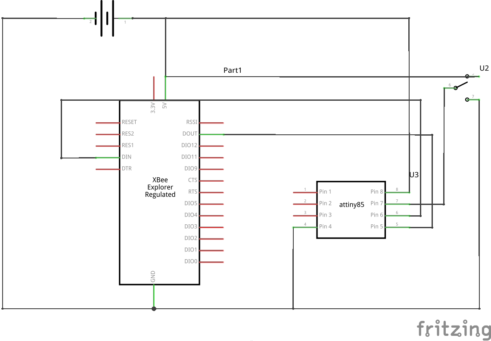
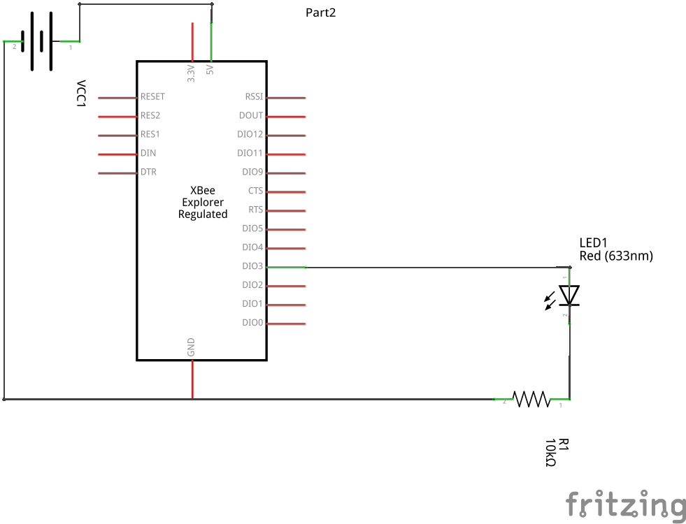
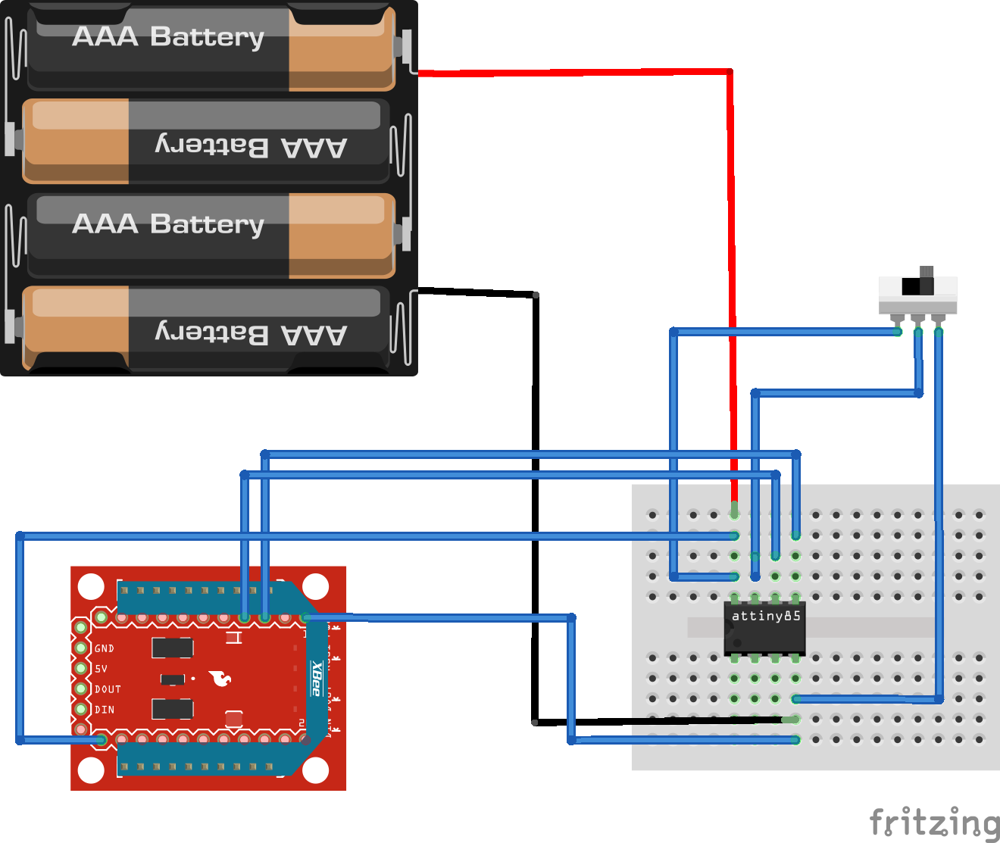
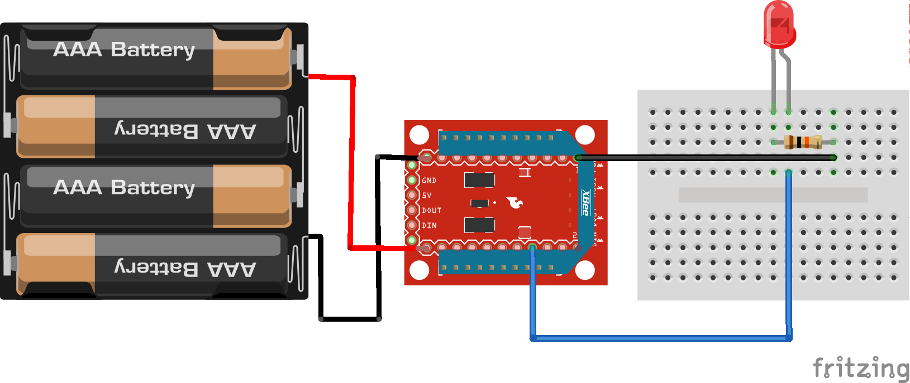

Zigbee Interfacing with Anuduino
================================

Overview of the Experiment
--------------------------

In this experiment we have shown zigbee communication using anuduino.We have used one anuduino board and two xbee modules,one configured as coordinator and the other as receiver using XCTU software.At sender side a switch is connected to the anuduino.If the switch is closed,the anuduino sends a signal via the xbee which energizes a relay at the receiver side and the led glows.If switch is open,the signal sent via zigbee turns off the led.

The configuration of the XBees was done using the X-CTU software.The coordinator XBee was configured to be in API mode and the router XBee to AT mode.The PAN IDs SHOULD be the same for both and enable JV for the router XBee.

Component required
------------------

- Breadboard     x2
- Attiny85       x1
- XBeeProSeries2 x2
- XBee Shields   x2
- Switch         x1
- Resistor(10k)  x1
- LED            x1
- Wires
- Powersupply(5V)

Schematic
---------

Transmitter
-----------

Receiver
--------

Circuit Diagram
---------------

Transmitter
-----------

Receiver
--------

Code
----

.. code-block::  c

	#include <SoftSerial.h>
	#include <TinyPinChange.h>

	SoftSerial xbee(0, 1);

	void setup()
	{
 	 pinMode(2,INPUT);
  	Serial.begin(9600);
  	xbee.begin(9600);
	}

	void loop()
	{
  	if(digitalRead(2)==HIGH)
  	 set(0x5);    //turns on the LED
  	if(digitalRead(2)==LOW)
   	set(0x4);    //turns off the LED
	}
	void set(char value)
	{
 	 xbee.write(0x7E); // Sync up the start byte
  	 xbee.write((byte)0x0);
  	 xbee.write(0x10); // Length LSB
  	 xbee.write(0x17); // 0x17 is the frame ID for sending an AT command
 	 xbee.write((byte)0x0); // Frame ID (no reply needed)
 	 xbee.write((byte)00); // Send the 64 bit destination address
 	 xbee.write((byte)00); // (Sending 0x000000000000FFFF (broadcast))
 	 xbee.write((byte)00);
 	 xbee.write((byte)00);
  	 xbee.write((byte)00);
  	 xbee.write((byte)00);
  	 xbee.write(0xFF);
 	 xbee.write(0xFF);
 	 xbee.write(0xFF); // Destination Network
	 xbee.write(0xFE); // (Set to 0xFFE if unknown)
 	 xbee.write(0x02); // set to 0x)2 to apply these changes
 	 xbee.write('D');  //AT command:D1
 	 xbee.write('3');
 	 xbee.write(value); // Set D1 to be 5 (Digital Out HIGH)
 	 long chexsum = 0x17 + 0xFF + 0xFF + 0xFF + 0xFE + 0x02 + 'D' + '3' + value;
 	 xbee.write( 0xFF - (chexsum & 0xFF)); // Checksum
	}

