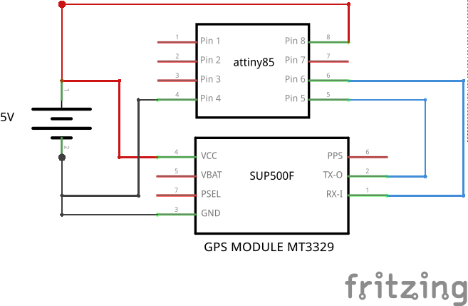
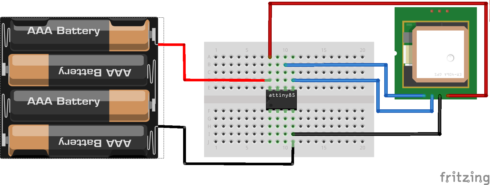

GPS Anuduino Interfacing
========================

Overview of the Experiment
--------------------------

GPS stands for Global Positioning System.It is a space-based satellite navigation system that provides location and time information in all weather conditions, anywhere on or near the Earth where there is an unobstructed line of sight to four or more GPS satellites.The system provides critical capabilities to military, civil and commercial users around the world. It is maintained by the United States government and is freely accessible to anyone with a GPS receiver.

In this experiment we have interfaced an anuduino board with a GPS module MT3329 to find our current location in terms of the latitude and longitude respectively.The values given by the GPS have to be divided by a factor of 10 so that they fall within the GPS range. For example, if the value is 37664939 and -121234543 for latitude and longitude respectively,then divide each by 1000000 to get the real value.

Before uploading the code,the tinyGPS library has to be downloaded.

Components required
-------------------

- Breadboard              x1
- Attiny85                x1
- GPS Module MT3329       x1
- Wires
- Powersupply(5V)

Schematic
---------

Circuit Diagram
---------------

Code
----

.. code-block::  c
	

    #include <SoftwareSerial.h>
    #include <TinyGPS.h>
     
    long lat,lon; // create variable for latitude and longitude object
     
    SoftwareSerial gpsSerial(2, 3); // create gps sensor connection
    TinyGPS gps; // create gps object
     
    void setup(){
    Serial.begin(9600); // connect serial
    gpsSerial.begin(4800); // connect gps sensor
    }
     
    void loop(){
    while(gpsSerial.available()){ // check for gps data
    if(gps.encode(gpsSerial.read())){ // encode gps data
    gps.get_position(&lat,&lon); // get latitude and longitude
    // display position
    Serial.print("Position: ");
    Serial.print("lat: ");Serial.print(lat);Serial.print(" ");// print latitude
    Serial.print("lon: ");Serial.println(lon); // print longitude
    }
    }
    }
