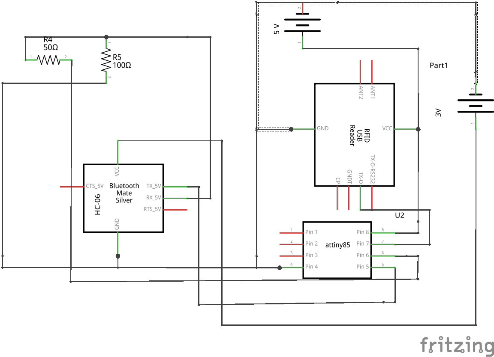
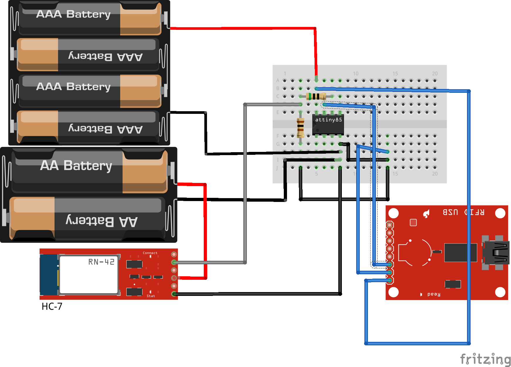

RFID Anuduino Interfacing via Bluetooth
=======================================

Overview of the Experiment
--------------------------

Radio-frequency identification (RFID) is the wireless non-contact use of radio-frequency electromagnetic fields to transfer data, for the
purposes of automatically identifying and tracking tags attached to objects. The tags contain electronically stored information. Some tags
are powered by and read at short ranges (a few meters) via magnetic fields (electromagnetic induction). In this experiment we are just extracting the tag ID for which we have used software serial library to interface bluetooth to view the tag ID on the phone when the RFID tag comes in range of the RFID reader.

Components required
-------------------

- Breadboard              x1
- Attiny85                x1
- Bluetooth module HC-06  x1
- RFID module             x1
- RFID tags               x2
- Resistor(100 ohm)       x1
- Resistor(50 ohm)        x1
- Wires
- Powersupply(5V & 3.3V)

Schematic
---------

Circuit Diagram
---------------

Code
----

.. code-block::  c

	/*@author_Chandana G*/
	#include <SoftSerial.h>
	#include <TinyPinChange.h>

	#define rxPin 0
	#define txPin 1

	SoftSerial myserial(2,3);
	SoftSerial bluetooth(0,1);

	void setup()  {

	  pinMode(rxPin, INPUT);
	  pinMode(txPin, OUTPUT);
	
	  bluetooth.begin(9600);
	  myserial.begin(9600);
	
	
	}
	
	void loop() {
	
	  if(myserial.available())
	   bluetooth.write(myserial.read());
	 }
