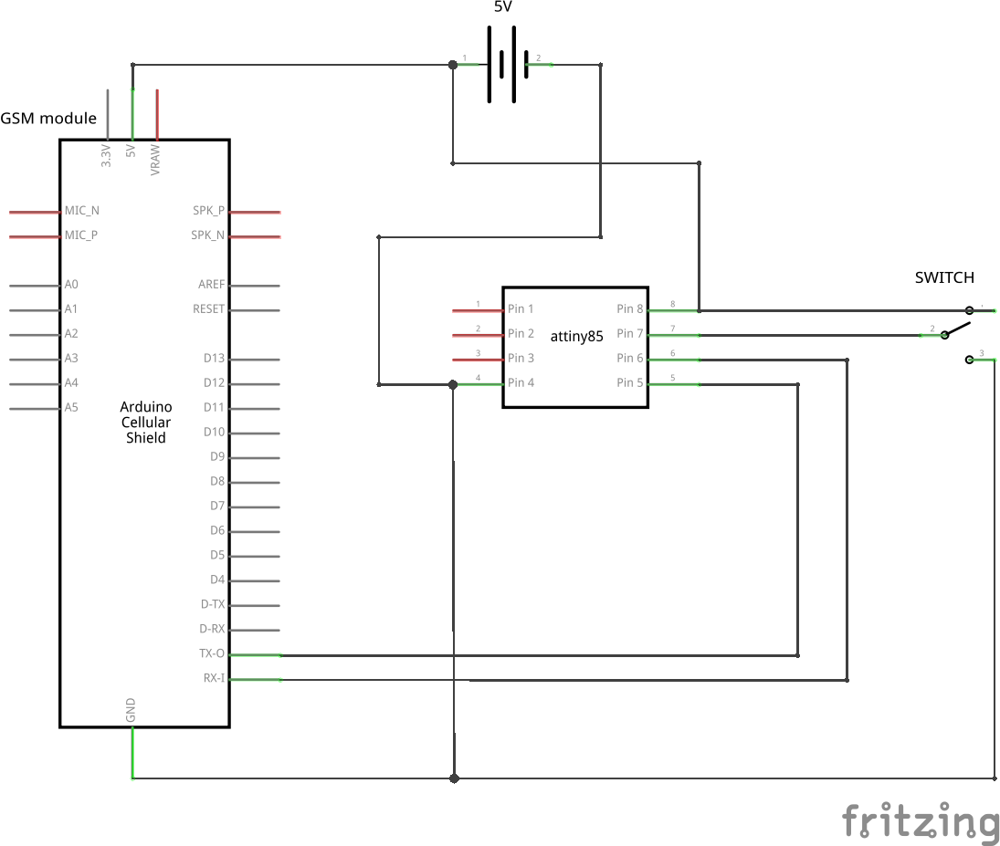
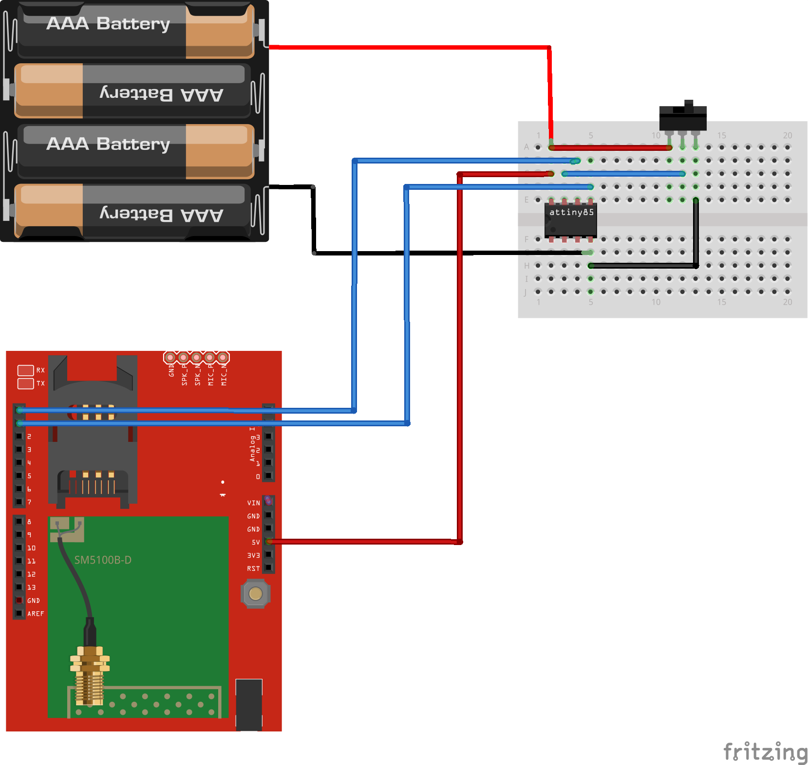

GSM Anuduino Interfacing
==============================

Overview of the Experiment
--------------------------

GSM stands for Global System for Mobile Communications.It is a standard set developed by the EuropeanTelecommunications Standards
Institute (ETSI) to describe protocols for second generation (2G) digital cellular networks used by mobilephones.

A GSM Modem is a device that modulates and demodulates the GSM signals and in this particular case 2G signals. The modem we are using is
SIMCOM SIM300. It is a Tri-band GSM/GPRS Modem as it can detect and operate at three frequencies (EGSM 900 MHz, DCS 1800 MHz and PCS1900
Mhz). Default operating frequencies are EGSM 900MHz and DCS 1800MHz.

Sim300 is a widely used in many projects and hence many variants of development boards for this have been developed. Sim300 GSM module
used here, consists of a TTL interface and an RS232 interface. The TTL interface allows us to directly interface with a microcontroller while
the RS232 interface includes a MAX232 IC to enable communication with the PC. It also consists of a buzzer, antenna and SIM slot. Sim300 in
this application is used as a DCE (Data Circuit-terminating Equipment) and PC as a DTE (Data Terminal Equipment).

In this experiment we have a switch connected to PB2 of ATtiny85 interfaced with GSM module which sends a message "Hello world" when
the pin PB2 goes high.

Components required
-------------------

- Breadboard              x1
- Attiny85                x1
- GSM module              x1
- Switch                  x1
- Wires
- Powersupply(5V)

Schematic
---------

Circuit Diagram
---------------

Code
----

.. code-block::  c

	/*@author_Harish G*/
	#include <SoftSerial.h>
	#include <TinyPinChange.h>
	
	SoftSerial gsm(0,1);
	
	void setup()
	{
	  Serial.begin(9600);
	  gsm.begin(9600);
	  gsm.println("AT+CMGF=1");
	  delay(30);
	  gsm.println("AT+CMGS=\"+91xxxxxxxxxx\""); //mobile no. to which the msg is to be sent
	  delay(30);
	  gsm.println("Hello world");
	  delay(30);
	  gsm.write((byte)0x1A); //Ctrl+Z
	  delay(30);
	  pinMode(2,INPUT);
	}
	void loop()
	{
	 if(digitalRead(2)== HIGH)
	 {  gsm.println("Hello world");
	  delay(1000);
	  gsm.write((byte)0x1A); //Ctrl+Z
	  delay(1000);
	 }
	 if(digitalRead(2)==LOW)
	 {
	   ;
	  //delay(30);
	 }
	 }
