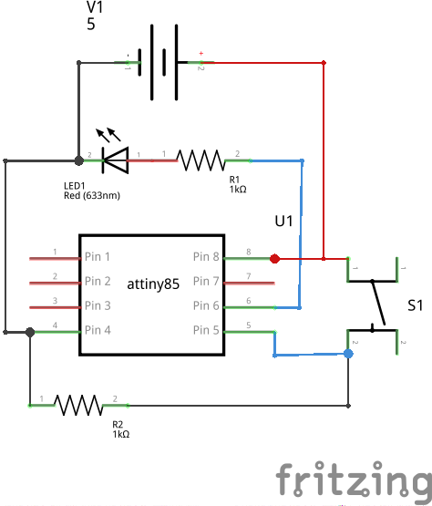

Switch button interfacing with Anuduino 
=======================================

Components reqiured
-------------------

- Breadbord        X1
- Pushbutton      X1
- Resistor (1K)    X1
- LED                        X1
- Wires

Schematic
---------

Circuit Diagram
---------------

.. image:: ../images/2_SWITCH_bb.png

Code
----

.. code-block::  c

   /*
   Button
 
   Turns on and off a light emitting diode(LED) connected to digital  
   pin 1, when pressing a pushbutton attached to pin 0. 
 
 
   The circuit:
  * LED attached from pin 1 to ground 
  * pushbutton attached to pin 0 from +5V
  * push button is connected to ground through 1k resistor
 
  */
   // constants won't change. They're used here to 
  // set pin numbers:
  const int buttonPin = 0;     // the number of the pushbutton pin
  const int ledPin = 1 ;      // the number of the LED pin

  // variables will change:
  int buttonState = 0;         // variable for reading the pushbutton status

  void setup() {
  // initialize the LED pin as an output:
  pinMode(ledPin, OUTPUT);      
  // initialize the pushbutton pin as an input:
  pinMode(buttonPin, INPUT);     
  }

  void loop(){
  // read the state of the pushbutton value:
  buttonState = digitalRead(buttonPin);

  // check if the pushbutton is pressed.
  // if it is, the buttonState is HIGH:
  if (buttonState == HIGH) {     
    // turn LED on:    
    digitalWrite(ledPin, HIGH);  
  } 
  else {
    // turn LED off:
    digitalWrite(ledPin, LOW); 
  }
  }
