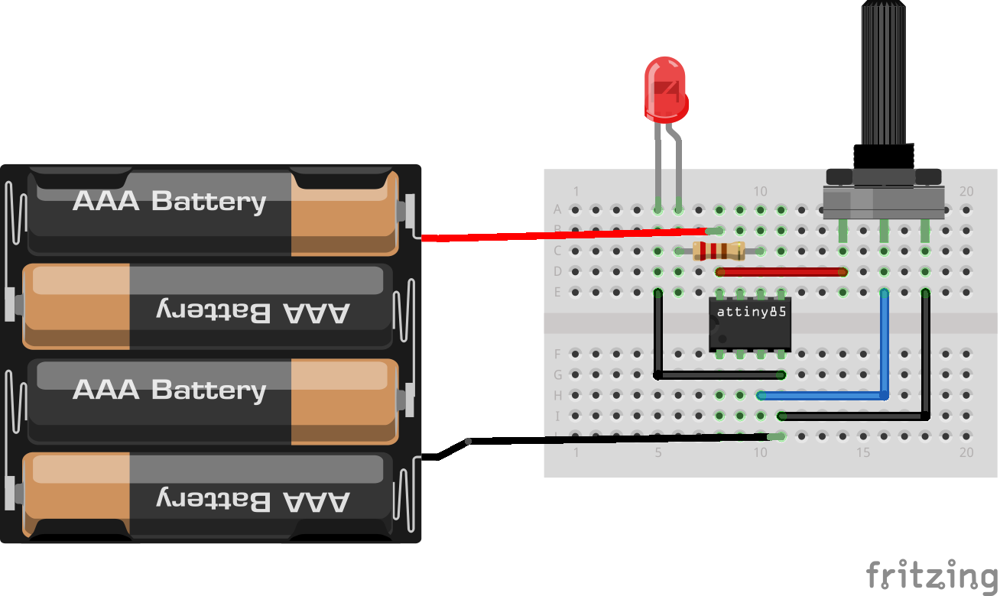

PWM-Anuduino
============

Overview of the experiment
--------------------------

Anuduino has 3 analog pins which can be used for analog input. These inputs take a voltage(0 to 5V) and convert it to a digital number between 0(0 volts) and 1023(5 volts) (10 bits of resolution). A very useful device that exploits these inputs is a potentiometer. When it is connected with 5 volts across its outer pins the middle pin will read some value between 0 and 5 volts dependent on the angle to which it is tuned(ie 2.5 volts in the middle). we can then use the returned values as a variable in our program. 

Components required
-------------------

- Breadboard          	         X1
- Attiny85   	                 X1
- LED       	                         X1
- Potentiometer(10k)  X1
- Resistor(470 ohm)      X1

Schematic
---------

.. image:: ../images/3_PWM-anuduino_schem.jpg

Circuit Diagram
---------------

Code
----

.. code-block:: c

	int ledPin = 1;      // LED connected to port 1
	int analogPin = 2;   // potentiometer connected to adc 2
	int val = 0;         // variable to store the read value
	int aref = 0;

	void setup()
	{
 	 pinMode(ledPin, OUTPUT);   // sets the pin as output
	}

	void loop()
	{
	  val = analogRead(analogPin);   // read the input pin
  
	  analogWrite(ledPin,val/4);
	}

