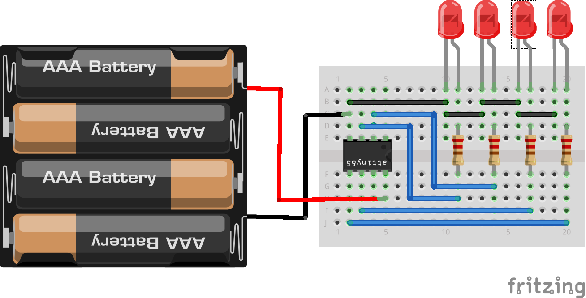

Array of LEDs with Anuduino 
===========================

Overview of the experiment
--------------------------

We have blinked one LED, Now it's the time to up the stakes. Lets connect four
LEDs.We also have an opportunity to stretch the anuduino a bit by creating various
lighting sequences. This circuit is also a nice setup to experiment with writing 
your own programs and getting a feel for how the anuduino works.

Components required
-------------------

- Breadboard         x1
- Attiny85           x1
- LEDs               x4
- resistors(470ohm)  x4
- Powersupply(5V)

Schematic
---------

.. image:: ../images/5_Array-of-LEDs_schem.png

Circuit Diagram
---------------

Code
----

.. code-block:: c

	
     // @Author_Nivedita Tigadi.//
     
      void setup() {   
  
        // initialize the following pins as output.
  
          pinMode(0, OUTPUT); //LED on pin 0
          pinMode(1, OUTPUT); //LED on pin 1
          pinMode(3, OUTPUT); //LED on pin 3
          pinMode(4, OUTPUT); //LED on pin 4
    
	}

	// the loop routine runs over and over again forever:
	void loop() {
 	digitalWrite(0, HIGH); // turn the 1st LED on (HIGH is the voltage level)
  	delay(500);   
  	digitalWrite(1, HIGH); // turn the 2nd LED on (HIGH is the voltage level)
	delay(500); 
 	digitalWrite(3, HIGH); // turn the 3rd LED on (HIGH is the voltage level)
  	delay(500);   
 	digitalWrite(4, HIGH); // turn the 4th LED on (HIGH is the voltage level)
 	delay(500);               
 	digitalWrite(0, LOW);  // turn the 1st LED off by making the voltage LOW
	delay(500);  
 	digitalWrite(1, LOW); // turn the 2nd LED off by making the voltage LOW
  	delay(500); 
  	digitalWrite(3, LOW);  // turn the 3rd LED off by making the voltage LOW
	delay(500);   
 	digitalWrite(4, LOW);  // turn the 4th LED off by making the voltage LOW
 	delay(500);            
	}

