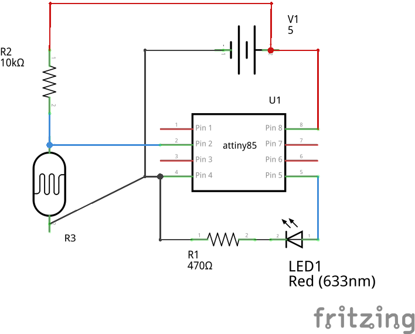
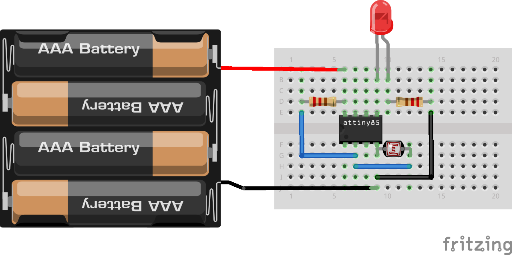

LDR-Anuduino
============

Overview of the experiment
--------------------------

In this experiment we use the same same principles as PWM-anuduino experiment, 
but instead of a potentiometer we use a photo resistor(LDR).As the light intensity 
falling on LDR varies the intensity of LED also varies.

Components required
-------------------

- breadboard  x1
- attiny85    x1
- LDR         x1
- LED         x1
- Resistor(470ohm,10kohm) x1
- powersuply(5V) x1

schematic
---------

Circuit diagram
---------------

Code
----

.. code-block:: c
	   /*
        * A simple programme that will change the intensity of
        * an LED based  * on the amount of light incident on   
        * the photo resistor.
        */
    
         //PhotoResistor Pin
            int lightPin = 2; //the analog pin the photoresistor is 
                  //connected to
                  //the photoresistor is not calibrated to any units so
                  //this is simply a raw sensor value (relative light)
                  //LED Pin
             int ledPin = 1;   //the pin the LED is connected to
                  //we are controlling brightness so 
                  //we use one of the PWM (pulse width
                  // modulation pins)
         void setup()
        {
       pinMode(ledPin, OUTPUT); //sets the led pin to output
         }
        /*
         * loop() - this function will start after setup    
         * finishes and then repeat
         */
      void loop()
        {
        int lightLevel = analogRead(lightPin); //Read the
                                        // lightlevel
        lightLevel = map(lightLevel, 0, 900, 0, 255); 
         //adjust the value 0 to 900 to
         //span 0 to 255

         lightLevel = constrain(lightLevel, 0, 255);//make sure the 
                                           //value is betwween 
                                           //0 and 255
        analogWrite(ledPin, lightLevel);  //write the value
         }
