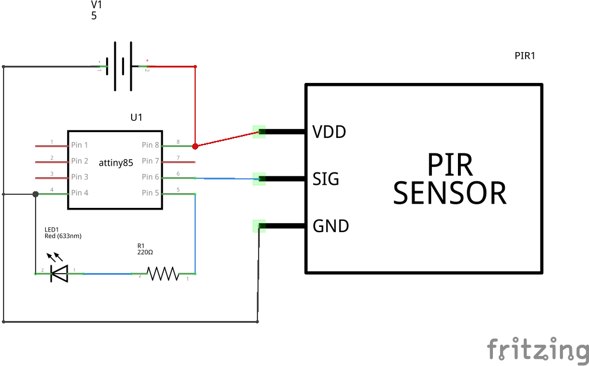
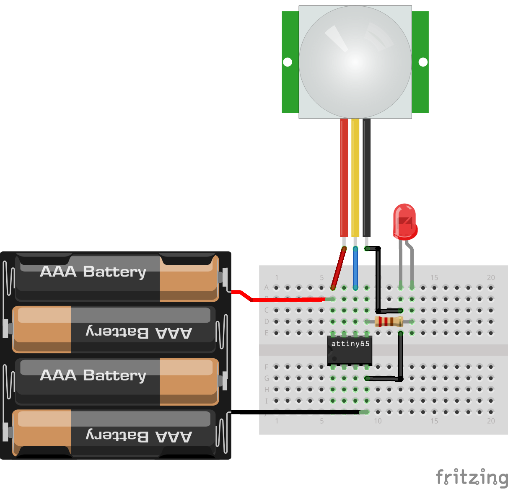

PIR-Sensor-Anuduino
===================

Overview of the experiment
--------------------------

A PIR-based motion detector is used to sense movement of people,
animals, or other objects. They are commonly used in burglar alarms 
and automatically-activated lighting systems. They are called simply
"PIR" Pyroelectric Infrared senosr. In this experiment,we are going 
to interface PIR with our Attiny85. The LED glows whenever PIR detects 
motion. When there is no motion LED will be OFF. 

Components required
-------------------

- Breadboard      x1
- PIR sensor      x1
- LED             x1
- Resistor(220ohm)x1
- Powersupply(5V)

Schematic 
---------

Circuit Diagram
---------------

Code
----

.. code-block::  c

    
    // @Author_Nivedita Tigadi.
    
	int pirPin = 1;    //the digital pin connected to the PIR sensor's output
	int ledPin = 0;

	void setup()
      {
 	 pinMode(pirPin, INPUT);
 	 pinMode(ledPin, OUTPUT);
 	 digitalWrite(pirPin, LOW);
      }
  
       void loop()
      {
        if(digitalRead(pirPin) == HIGH)
        {
        digitalWrite(ledPin, HIGH); 
        }
     
        if(digitalRead(pirPin) == LOW)
        {
        digitalWrite(ledPin, LOW);
        }
      }

